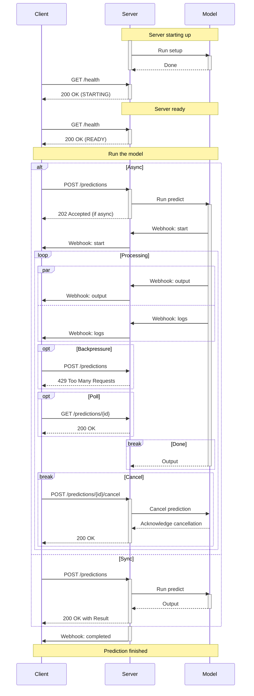

# Cog HTTP Server, Re-written in Rust

(Early exploration of using Rust to serve Cog models)

## Overview

- `Server` handles HTTP requests as documented in [HTTP](/docs/http.md)
  - `Health` enumeration: `starting`, `ready`, `busy`, `setup_failed`, `shutting_down`
    - (Maybe consolidate `setup_failed` and `shutting_down` as `terminating`?)
- `Configuration` describes a `cog.yaml` file
- `Runner<T>` manages a model instance, providing a service consumed by Server
  - `Runner<Predictor>` for inference
  - `Runner<Trainer>` for training/fine-tuning
  - (Eventually)
    - `Runner<Function>` for functional Cog model with `run`
    - `Runner<Application>` for Cog model with multiple endpoints
- `Worker` handles a single request to a model
  - A runner manages a pool of workers
  - (May instead be managed by other async primitive like task mapping)

---

- Program is launched with following:
  - An optional `-C`/`--project` path (`.` by default)
  - An optional `-f`/`--config` path (`./cog.yaml` by default)
  - An optional `-d`/`--mode`, either `predict` or `train`
    - If model has predictor, default to `predict` mode
    - Otherwise, default to `train` mode
    - (Eventually)
      - This option is invalid for functional models or application models
  <!-- - A required JSON `--schema` for the model (see below) -->
  - An optional `-j`/`--concurrency`
    - Must be unset or set to `1` if `mode` is  
    - Defaults to max concurrency if configured
    - If configured with `gpu: false`, 
      max concurrency is configured to (number of CPUs - 1),
      and `predict`
  - An optional `--upload-url` option, used for upload requests
  - An optional `--statistics` option, used to hint server about performance 
    - For example, `{"setup": {"p50": 30}}` indicates mean setup time of 30s
    - `Server` can use this to provide `Retry-After` in `503` responses
  - An optional `--host` option (`0.0.0.0` by default)
  - An optional `--port` (`5000` by default)
  - (Eventually)
    - Option for backing store? (in-memory? Redis?)
    - Option for maximum queue depth?
  
- Program loads `cog.yaml` into a `Configuration`
  - Throw error if configuration is invalid
- `Server` initializes a `Runner` with configuration and selected mode
- `Server` starts listening for HTTP requests on configured port
  - `Server` accepts requests immediately and responds appropriately
    - For healthcheck, returns `"STARTING"`
    - For other endpoints, returns `503` response
      - In future, we may allow requests to be enqueued before setup is complete
  - Additional `Server` endpoints are contingent on mode
    - If `predict`, then `POST /predictions`
    - If `train`, then `POST /trainings`
    - (Eventually)
      - If functional model, then `POST /run`
- `Runner` loads configured predictor or trainer
  - Throw error if configuration is missing key for selected mode
  - Throw error if file cannot be found
  - Throw error if file cannot be loaded
  - If predictor/trainer is a class, initialize the class
    - Throw error if class couldn't be initialized
    - Load `setup` method and store in runner
      - `setup` isn't required 
      - Throw error if `setup` exists but can't be stored
  - Stores `predict`/`train` method
    - Throw error if `predict`/`train` method can't be stored
  <!-- - Warn if loaded predictor/trainer has interface not compatible with spec
    - Or throw error instead if `--strict` (sp?) setting is enabled -->
- `Runner` runs `setup` once, if defined
    - `setup` may be a method (`def`) of coroutine (`async def`)
    - `Runner` takes care of resolving that distinction
- Once `setup` has finished...
  -  `Runner` spawns pool of N workers
     -  Configured by `-j`/`--concurrency` option
  - `Server` can begin processing requests...
    - `Server` translates HTTP requests to requests for `Runner`
    - `Runner` calls stored `predict` or `train` function with request
    - Contract for HTTP interaction are spelled out [here](/docs/http.md)
- When `Server` receives a `POST /shutdown` request...
  - `Server` returns `"TERMINATING"` for health checks
  - `Server` stops accepting othernew requests
  - Wait for each `Worker` in `Runner` pool to finish




## Cog Model Schema

Currently, we use OpenAPI schema as common interchange format for Cog models.
OpenAPI is useful for describing the contract of Cog as a service,
but there's a lot of extra cruft that's irrelevant boilerplate.

Below, we define a meta-schema for Cog models and provide examples of its use:

### Meta-schema

```jsonc
{
    "$schema": "https://json-schema.org/draft/2020-12/schema",
    "$id": "https://cog.run/schemas/model"
    "oneOf": [
        // Where we are today:
        {
            "$comment": "Cog model with predict and/or train function",
            "type": "object",
            "properties": {
                "predictor": { "$ref": "#/$defs/function" },
                "trainer": { "$ref": "#/$defs/function" }
            },
            "minProperties": 1
        },
        // Where we want to go:
        {
            "$comment": "Cog model as single function",
            "$ref": "#/$defs/function"
        },
        {
            "$comment": "Cog model with arbitrary endpoints",
            "$ref": "https://spec.openapis.org/oas/3.1/schema/2022-10-07/$defs/paths"
        }
    ],
    "$defs": {
        "function": {
            "$id": "https://cog.run/schemas/function",
            "type": "object",
            "properties": {
                "input": { "type": "object" },
                "output": { "type": "object" }
            },
            "required": [ "input", "output" ]
        },
        "data": {
            "type": "string",
            "contentEncoding": "base64"
        },
        "url": {
            "type": "string",
            "format": "uri",
            "pattern": "^https?:\/\/"
        },
        "file": {
            "$id": "https://cog.run/schemas/file",
            "oneOf": [
                { "$ref": "#/definitions/data" },
                { "$ref": "#/definitions/url" }
            ]
        },
        "stream": { "$ref": "#/definitions/url" }
    }
}
```

### Example Schema

```json
{
  "$schema": "https://cog.run/schemas/model",
  "$id": "https://replicate.com/example/txt2img",
  "description": "...",
  "type": "object",
  "properties": {
    "input": {
      "title": "Input",
      "type": "object",
      "required": [
        "prompt"
      ],
      "properties": {
        "prompt": {
          "x-order": 0,
          "title": "Prompt",
          "description": "Text prompt for image generation.",
          "type": "string"
        }
      }
    },
    "output": {
        "title": "Output",
        "type": "array",
        "items": { 
            "$ref": "https://cog.run/schemas/file",
            "contentMediaType": "image/*"
         }
    }
  }
}
```

### Example Input

```json
{
    "prompt": "astronaut riding a riding unicorn"
}
```

## Cog OpenAPI Specification

- Endpoints and Request / Response contracts are enumerated in OpenAPI spec
  - Wrap underlying request / response
- Cog OpenAPI may expand to provide additional endpoints dependencing on functionality provided

## Content and disposition

For inputs and outputs:
- Model defines type of content
- Server negotiates disposition, encoding, and compression
	- Including uploading and sending of webhooks

#### Example 1: txt2img single

```python
from cog import Image

# Image = pydantic.Annotated[PIL.image, ...]

def generate(prompt: str, mask: Image) -> Image:
	...
```

- Client may provide `mask` as:
	- HTTPS URL: `https://example.com/mask.png`
	- Data URL: `data:img/png;base64,SGVsbG8sIFdvcmxkIQ==`
- Server may return outputs as:
	- HTTPS URL: `https://replicate.delivery/output.png`
	- Data URLs: `data:img/png;base64,QIkxmcvdFIs8GbsVGS==`

#### Example 2: txt2img multiple

```python
from cog import Image, Stream

def generate(prompt: str, num_outputs: int) -> Stream[Image]:
	...
```

- Server may return outputs as:
	- JSON array of HTTPS URL: `https://replicate.delivery/output.png`
	- SSE of HTTPS URLs
	- SRT stream of data
		<!-- ??? How does that work with Director ???  -->

#### Example 3: LLM

```python
from cog import Stream, Token

# Token = pydantic.Annotated[str, ...]
# ConcatenateIterator[str] is deprecated in favor of `Stream[Token]`

def completion(prompt: str) -> Stream[Token]:
	...
```

- Server may return outputs as:
	- JSON Array of tokens
	- HTTPS URL to file containing JSON tokens
	- SSE of tokens

#### Example 4: Embeddings

```python
from cog import Stream
import numpy as np

# Support https://data-apis.org/array-api-compat
# Vector: TypeAlias = # ???

def predict(prompt: str) -> np.array[np.float16]]:
	...
```

- Server may return outputs as:
	- JSON Array of numbers
	- HTTPS URL to file containing JSON numbers
	- ??? How do we support other binary encodings ???
	- 
#### Example 4: img+audio2vid

```python
from cog import Image, Stream, Audio, Video

def morph(reference: Image, source: Steam[Audio]) -> Stream[Video]:
	...
```

- Client may send `source` as:
	- HTTPS URL to audio file
	- HTTPS URL to SRT audio stream
	- (Unlikely) Data URL containing short audio file 
- Server may return output as:
	- HTTPS URL to SRT audio stream
	- (Unlikely) Data URL containing short video file 
